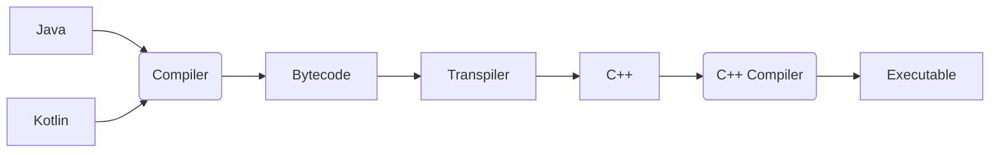

# Clearwing VM
[](https://jitpack.io/#com.thelogicmaster/clearwing-vm)

## About
This is a Java to C++ transpiler based on the CodenameOne Parpar VM. It was created for use in 
[SwitchGDX](https://github.com/TheLogicMaster/switch-gdx), the Nintendo Switch Homebrew and Xbox UWP backend for
the [LibGDX](https://libgdx.com) game framework. It features a stripped down runtime library and produces native
executables that don't require a VM to run. A minimal example based on Gradle and CMake is provided.



## Features
- Regex ([RegExodus](https://github.com/tommyettinger/RegExodus))
- Basic File I/O
- Buffers (Direct and ByteBuffer wrappers)
- Basic threading
- Reflection (Requires reflection metadata enabled per-class)
- Java 7 runtime with Java 8 features (lambdas, method references, and default methods)
- Incremental compilation
- Plain C++ 20 project output
- Easy Gradle integration
- Class-level optimization (Only required classes are built)
- Instruction-level optimizations (Partially decompile Bytecode into optimizable C++)

## Limitations
- Limited runtime library
- Not fully conformant with standard (Regex, string formatting, internal names)
- Has to be debugged as a large C++ codebase
- Long initial compilation and linkage times

## Todo
- Testing suite
- Further runtime library support
- Transpiler logging
- Method trimming
- Crash logs

## Dependencies
- C++ 20
- ZLib
- ZZip
- CMake (If using default project files)

## Usage
The transpiler is provided as a fat JAR which can be used as a standalone commandline tool or integrated into a 
build system. An example is provided for a simple Gradle based project which produces and builds a CMake C++ 
project. Command line arguments are used for specifying the input and output directories as well as a JSON config
file for further configuration of transpiler options. The transpiler is also provided as a normal Java library 
which could be used programmatically. Java 16 is what the transpiler has been tested with.

JitPack Maven artifacts:
```
'com.thelogicmaster.clearwing-vm:transpiler:{version}'     // Fat JAR
'com.thelogicmaster.clearwing-vm:transpiler-lib:{version}' // Library JAR
'com.thelogicmaster.clearwing-vm:annotations:{version}'    // Annotations
```

The following command line arguments are provided:
- __--input, -i__: Input class directories (`build/classes`) or library JARs
- __--source, -s__: Source directories (`main/java/src`) to use for jnigen style inline native code generation (Optional)
- __--output, -o__: The output directory to write into (Required)
- __--main, -m__: The class with the `public static void main` entrypoint method (Optional)
- __--config, -c__: A JSON config file with further configuration options (Optional)
- __--project, -p__: Enable generating basic project files (Optional)

## Configuration
The JSON file specified by the `config` command line argument is loaded in addition to files ending in 
`clearwing.json` in the input JARs. Any pattern arguments accept wildcards, where `*` expands to any name section
and `**` expands to anything. 

The available options are as follows:
- __nonOptimized__: Patterns for classes to not optimize out even if unused
- __reflective__: Patterns for classes to generate reflection metadata for
- __intrinsics__: A list of methods to treat as native so that they can be patched (For example, `java.lang.Integer.toString()Ljava/lang/String;`)
- __useLeakCheck__: Records object leaks by class to `leaks.txt` (Has runtime overhead, requires gcc)
- __sourceIgnores__: Patterns for source files to ignore for jnigen style inlined C++
- __generateProjectFiles__: Whether to generate basic project files like the CMake config
- __mainClass__: An optional "main class" that contains the entrypoint main function
- __useStackTraces__: Enable stack traces (Disable for a slight performance increase)
- __useLineNumbers__: Enable stack trace line numbers (Requires stack traces, disable for a slight performance increase)
- __useValueChecks__: Enable type/NPE checks at runtime, has substantial performance overhead
- __useStackCookies__: Enable Java stack cookies (Only needed for debugging VM)

## Native Code
Native C++ code can be used with the project in a ways. The easiest way is to add native functions with trailing
block comments, ensuring that the Java source directory has been added to the command line parameters. This will
generate a corresponding C++ function with the inlined code, jnigen style, with helper code for accessing buffer,
string, and array data. You can also generate a code block outside of functions by using a block comment that starts
with `/*JNI`. You can also declare a method as `native` normally and later supply a C++ file implementing the function.
This approach can be tedious with the name mangling that takes place. If you need to replace an existing method with
a native implementation for performance reasons, you can add an entry to the `intrinsics` config option and define a
corresponding C++ function in the same way. There's no JNI library loading functionality, so native libraries need to
have bindings written for them.

## Building
As a Gradle project, there are tasks for building the needed components. JDK 16 is what has been tested with.
The runtime and example submodules get built with a language level of 8, and the transpiler uses language level 14.
When building the runtime in an Intellij, `Build>>Rebuild Project` may be necessary after making changes. 

## Technical Details
This project was originally just the CodenameOne Parpar VM made to work as a cross-platform C codebase, with 
various bug fixes and additional runtime library functionality added to work with LibGDX. As a C codebase using
structs and function pointer arrays to represent Java classes, it became quite tedious and challenging to debug,
especially for the garbage collector related memory bugs. The coding practices used in the transpiler side of the
project also left a lot to be desired, with the redundancy and lack of organization making it a challenge to 
maintain. As such, the decision was made to start from scratch with a new transpiler and "VM" that would utilize
modern C++. The C version is now available in the _legacy_ branch.

### Architecture
As one might expect, there are many challenges associated with bringing a Java codebase into C++. Being 
object-oriented, it makes reproducing Java class hierarchies substantially easier than with C, though there are
plenty of pitfalls with multi-inheritance. Memory management is another essential component, and an approach 
without a garbage collector was taken, instead relying entirely on smart pointers. This has substantial 
performance implications, but also makes memory safety far easier and eliminates the largest source of memory 
bugs. To actually parse the Java source,
the compiled ByteCode is disassembled and ingested by the transpiler, meaning that other JVM languages like
Kotlin are also compatible. The JVM Assembly is then statically analyzed to produce an output that a C++ 
compiler can effectively optimize, using techniques like converting values pushed onto the method stack into
local variables. There are also more minor challenges, like converting Java symbols to C++ ones while avoiding
name conflicts. This is primarily accomplished with namespaces corresponding to Java packages and field/method
name prefixes. Array parameter types and function return types also present a potential source of ambiguity,
so additional suffixes for types are added to uniquely identify said functions.

### Inheritance
To achieve Java inheritance, virtual C++ inheritance is used for both `extends` and `implements`. Aside from
in fields and method parameters, object references are stored as Object shared pointers, meaning that dynamic 
casting, which has runtime overhead, is needed quite often. As such, cast values will be cached by the
transpiler where possible. The get an Object shared pointer from within a method, `enable_shared_from_this` is
implemented by Object and accessible by `get_this()`. For this to work in default methods on interfaces,
since they don't extend Object, each interface also implements this. Since virtual inheritance is used, the
diamond problem that could occur with interfaces is avoided. C++ hides functions in parent class functions if 
they have the same name but a different signature, so using statements are generated to prevent this. If a
function appears in two parents, then a bridge function or virtual definition needs to be added to clear up
the ambiguity.

### VM
The "VM" part of the project is a handful of C++ files that handle interfacing with the host system, providing
an initialization mechanism, and various helper functions. `Clearwing.hpp` is the main header, providing the 
primary types and functions. `Array.hpp` is the representation of a Java array. `Object.cpp` is the only
non-autogenerated runtime class, since it's the parent type. `Config.hpp` and `main.cpp` are autogenerated by
the transpiler, storing configuration flags and the program entrypoint, respectively. `Instructions.hpp` stores
the C++ representations of JVM instructions, though most won't be used due to transpiler optimizations. The 
`impl` directory stores the runtime intrinsic methods that are implemented natively for performance or system
API access. VM fields and functions are all placed in the `vm` namespace to avoid name conflicts.
Class registration is done by individual classes calling the `registerClass` during global initialization. No 
generated code can be called at this point to avoid circular dependencies during VM startup, so the required
arrays, strings, and classes are specially crafted to avoid calling any Java static initializers. After this
point, the main program entrypoint is run, the VM gets initialized, then the program runs, lazily initializing
classes as normal. Classes are stored into a map for easy retrieval by name. Similarly, strings are pooled and
placed into a map by address of the literal when using the literal `_j` suffix. 

### Types
Reference types are stored as shared pointers and primitive values are stored as their corresponding type. When
in a method local or on the method stack, types are stored as their arithmetic variants, meaning smaller types 
get promoted to int and the remaining ones are stored the same way. Wide types (Long and double) normally would
occupy two stack/local slots, but here, all types are stored in a `std::variant` which can accommodate any
arithmetic or reference type. Where possible, the transpiler will replace the variant wrapper with the specific
type for that local or stack value. For common reference types like objects, arrays, strings, classes, and each
of the primitive values, typedefs are provided in the form of `jobject`, `jint`, `jarray`, and so on. Arrays
are a bit special in that they don't have variants for different component types. Instead, they contain a
`void *` to their data along with the name of the type they contain. It's up to the accessor to know the type
that a given array contains, though there are type checks for primitive/reference values to avoid memory bugs.
Since they are all types as `jarray`, they don't count as unique types for function signatures, so the C++
function names for methods have array types appended to them. Strings are normal objects, but get constructed
from C-strings or C++ UTF-8 literals using the custom `_j` suffix. The value is stored as UTF-16 and can be
retrieved as a C-string using the `getNativeString` function. Classes are also normal objects, but get
constructed by the VM when registering object classes or creating classes for array types. To avoid retain 
cycles with references, the `Weak` annotation is provided in the `annotations` module or in the `weakFields`
config option to store the specified reference as a `weak_ptr` rather than a shared one. This should only be 
used where Objects are always stored elsewhere, since it can cause premature object destruction if not used 
carefully.

### Object Construction and Destruction
The C++ constructor for Object takes only the class name as a parameter, with the rest of the constructors
being no-argument, aside from Array. As such, a Java constructor needs to be separately called after object
construction. For finalization, it's a bit more complex. Since the destructor is only called once the
shared pointer reference count reaches zero, you can't just retrieve a new shared pointer, but the finalizer
needs access to an instance shared pointer. As a workaround, a dummy shared pointer is constructed which
doesn't try to extend the lifetime of the object. 

### Exceptions
Rather than using setjmp like the C version, C++ exception catching was utilized to handle exception control
flow. The `jobject` type is thrown and caught, checking if the type matches the type for that block, then
rethrown if it doesn't match. This presents an issue with branch instructions, since you can't _goto_ into a
try-catch block. To work around this, an array of jump-bypass flags are present in the method where needed to
allow setting a flag and jumping before the try-block to allow entering, then immediately jumping to the
actual label. The type thrown has to be a `jobject` exactly to be caught, so utility methods are
provided in `Utils.hpp` to easily construct and throw exceptions. `jobject` doesn't extend `exception`, so
the C++ compiler will complain a bit.

### Reflection
Reflection is accomplished by generating additional helper functions for classes with reflection metadata 
enabled. These functions handle accessing fields and calling methods, casting objects as needed and wrapping
primitives into their boxed types. For classes with annotations, a function is generated which instantiates the
annotation hierarchies when called from the static initializer. Because of annotation nesting, values need to
be recursively instantiated, but this is handled at compile time, expanding into a linear implementation in
the generator function. Because annotations are interfaces, an implementation class is generated for each
annotation that stores its values and implements the required getter methods. 

With the C version, libFFI was used for method reflection, but that approach didn't seem feasible with C++,
so helper functions are generated. For field accesses, it was originally done using class member offset hacks,
but using `offsetof` or null dereferencing isn't a portable solution. When field types were converted to be
stored as shared pointers to the derived type rather than Object, the field pointer approach became infeasible
and helper functions were utilized to perform the object casting and primitive boxing.

### Java 8 Features
Lambda and method reference functionality is accomplished by generating proxy classes which implement
the target interface, store captured values, and handle primitive boxing conversions. It only supports
the lambda factory InvokeDynamic target, so compiling with a version later than Java 8 may introduce 
unsupported calls for string building and such. Default methods are implemented by generating the default
implementation in the interface class itself, making use of C++ multi-inheritance.
