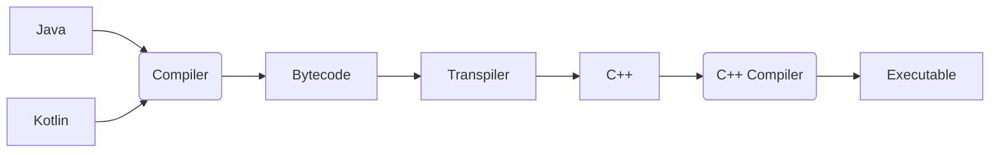

# Clearwing VM
[](https://jitpack.io/#com.thelogicmaster/clearwing-vm)

## About
This is a Java to C++ transpiler based on the CodenameOne Parpar VM. It was created for use in 
[SwitchGDX](https://github.com/TheLogicMaster/switch-gdx), the Nintendo Switch Homebrew and Xbox UWP backend for
the [LibGDX](https://libgdx.com) game framework. It features a stripped down runtime library and produces native
executables that don't require a VM to run. A minimal example based on Gradle and CMake is provided.



## Features
- Regex ([RegExodus](https://github.com/tommyettinger/RegExodus))
- Basic File I/O
- Buffers (Direct and ByteBuffer wrappers)
- Basic threading
- Reflection
- Java 7 runtime with Java 8 features (lambdas, method references, and default methods)
- Incremental compilation
- Plain C++ 20 project output
- Easy Gradle integration
- Class-level optimization (Only required classes are built)
- Instruction-level optimizations (Partially decompile Bytecode into optimizable C++)

## Limitations
- Limited runtime library
- Not fully conformant with standard (Regex, string formatting, internal names)
- Has to be debugged as a large C++ codebase
- Long initial compilation and linkage times

## Todo
- Testing suite
- Further runtime library support and specify which packages are supported
- Transpiler logging
- Method trimming
- Crash logs
- Add additional safe-points in loops without function calls to prevent freezes on GC

## Dependencies
- C++ 20
- ZLib
- ZZip
- CMake (If using default project files)

## Usage
The transpiler is provided as a fat JAR which can be used as a standalone commandline tool or integrated into a 
build system. An example is provided for a simple Gradle based project which produces and builds a CMake C++ 
project. Command line arguments are used for specifying the input and output directories as well as a JSON config
file for further configuration of transpiler options. The transpiler is also provided as a normal Java library 
which could be used programmatically. Java 17 is what the transpiler has been tested with.

JitPack Maven artifacts:
```
'com.thelogicmaster.clearwing-vm:transpiler:{version}'     // Fat JAR
'com.thelogicmaster.clearwing-vm:transpiler-lib:{version}' // Library JAR
'com.thelogicmaster.clearwing-vm:annotations:{version}'    // Annotations
```

The following command line arguments are provided:
- __--input, -i__: Input class directories (`build/classes`) or library JARs
- __--source, -s__: Source directories (`main/java/src`) to use for jnigen style inline native code generation (Optional)
- __--output, -o__: The output directory to write into (Required)
- __--main, -m__: The class with the `public static void main` entrypoint method (Optional)
- __--config, -c__: A JSON config file with further configuration options (Optional)
- __--project, -p__: Enable generating basic project files (Optional)

## Configuration
The JSON file specified by the `config` command line argument is loaded in addition to files ending in 
`clearwing.json` in the input JARs. Any pattern arguments accept wildcards, where `*` expands to any name section
and `**` expands to anything. 

The available options are as follows:
- __nonOptimized__: Patterns for classes to not optimize out even if unused
- __intrinsics__: A list of methods to treat as native so that they can be patched (For example, `java.lang.Integer.toString()Ljava/lang/String;`)
- __sourceIgnores__: Patterns for source files to ignore for jnigen style inlined C++
- __generateProjectFiles__: Whether to generate basic project files like the CMake config
- __mainClass__: An optional "main class" that contains the entrypoint main function
- __useStackTraces__: Enable stack traces (Disable for a slight performance increase)
- __useLineNumbers__: Enable stack trace line numbers (Requires stack traces, disable for a slight performance increase)
- __useValueChecks__: Enable type/NPE checks at runtime, has substantial performance overhead
- __useStackCookies__: Enable Java stack cookies (Only needed for debugging VM)

## Native Code
Native C++ code can be used with the project in a ways. The easiest way is to add native functions with trailing
block comments, ensuring that the Java source directory has been added to the command line parameters. This will
generate a corresponding C++ function with the inlined code, jnigen style, with helper code for accessing buffer,
string, and array data. You can also generate a code block outside of functions by using a block comment that starts
with `/*JNI`. You can also declare a method as `native` normally and later supply a C++ file implementing the function.
This approach can be tedious with the name mangling that takes place. If you need to replace an existing method with
a native implementation for performance reasons, you can add an entry to the `intrinsics` config option and define a
corresponding C++ function in the same way. There's no JNI library loading functionality, so native libraries need to
have bindings written for them.

## Building
As a Gradle project, there are tasks for building the needed components. JDK 17 is what has been tested with.
The runtime and example submodules get built with a language level of 8, and the transpiler uses language level 14.
When building the runtime in an Intellij, `Build>>Rebuild Project` may be necessary after making changes. 

## Technical Details
This project was originally just the CodenameOne Parpar VM made to work as a cross-platform C codebase, with 
various bug fixes and additional runtime library functionality added to work with LibGDX. As a C codebase using
structs and function pointer arrays to represent Java classes, it became quite tedious and challenging to debug,
especially for the garbage collector related memory bugs. The coding practices used in the transpiler side of the
project also left a lot to be desired, with the redundancy and lack of organization making it a challenge to 
maintain. As such, the decision was made to start from scratch with a new transpiler and "VM" that would utilize
modern C++. The C version is now available in the _legacy_ branch. The original C++ version used more convenient
and higher level C++ features like smart pointers, inheritance, and type variants, which made it much easier to
debug, but the result had performance and memory leak issues which were unsuitable for large projects. It was an
interesting experiment, but the lack of a garbage collector led to reference cycles leaking memory and the performance
overhead of storing stack values as variants and using smart pointer for all objects was huge, even after optimizations.
The current architecture aims to maintain a C ABI compatible interface for generated code and represents objects as
plain data structs. Since C++ is only used to make the code a bit nicer with templates and such (Especially in hand
writen code), exceptions use longjmp/setjmp rather than C++ exceptions, so it is generally unsafe to count on RAII
or non-volatile variable contents when calling code which can throw exceptions.

### VM
The "VM" part of the project is a handful of C++ files that handle interfacing with the host system, providing
an initialization mechanism, and various helper functions. `Clearwing.h` is the main header, providing the 
primary types and functions, as well as macros for implementing Java ByteCode. 
`Array.hpp` is the representation of a Java array. `Object.cpp` is the only
non-autogenerated runtime class, since it's the parent type. `Config.h` and `main.cpp` are autogenerated by
the transpiler, storing configuration flags and the program entrypoint, respectively. Class registration is 
done by individual classes calling the `registerClass` during global initialization. No 
generated code can be called at this point to avoid circular dependencies during VM startup, so the required
arrays, strings, and classes are specially crafted to avoid calling any Java static initializers. After this
point, the main program entrypoint is run, the VM gets initialized, then the program runs, lazily initializing
classes as normal. Classes are stored into a map for easy retrieval by name. Similarly, strings are pooled and
placed into a map by address of the literal when using the literal `_j` suffix. 

### Types
Reference types are stored as pointers and primitive values are stored as their corresponding type. When
in a method local or on the method stack, types are stored as their arithmetic variants, meaning smaller types 
get promoted to int and the remaining ones are stored the same way. Wide types (Long and double) normally would
occupy two stack/local slots, but here, all types are stored in a union which can accommodate any
arithmetic or reference type. For common reference types like objects, arrays, strings, classes, and each
of the primitive values, typedefs are provided in the form of `jobject`, `jint`, `jarray`, and so on. Arrays
are a bit special in that they don't have variants for different component types. Instead, they contain a
`void *` to their data along with the name of the type they contain. It's up to the accessor to know the type
that a given array contains, though there are type checks for primitive/reference values to avoid memory bugs.
Strings are normal objects, but get constructed
from C-strings or C++ UTF-8 literals using the custom `_j` suffix. The value is stored as UTF-16 and can be
retrieved as a C-string using the `getNativeString` function. Classes are also normal objects, but get
constructed by the VM when registering object classes or creating classes for array types.

### Garbage Collection
Garbage collection is done by the garbage collector at object allocation time based on the amount of memory and 
number of objects allocated since the last collection. It is a simple algorithm, but should be sufficient, and
macros are available to override the defaults if needed. All objects that aren't static class members, on a Java 
thread's stack, marked as eternal, and are not referenced by another reachable object will be collected when the
GC is run. Before running, the thread running the GC waits for all other threads to be at a safe-point. This 
normally happens during function calls, where threads check for thread suspension and wait for the GC to run. 
Currently, a thread that is busy waiting or otherwise blocking without performing any function calls could lead to
a system freeze when the GC tries to run. This issue could be prevented in the future by inserting safe-point calls
as needed in loops without function calls. A thread in native code like `Thread.sleep` can be treated as if it is
at a safe-point so long as it does not interact with VM objects or return to VM code until the GC is done. To avoid
premature collection of objects, it is essential to ensure that all objects are stored on the stack before calling
any functions, since it is the responsibility of the caller to protect arguments. That is the safest way for hand-writen
native code, but objects can also be marked as eternal at allocation time to prevent collection until marked accordingly.

### Exceptions
Exception handling is done using longjmp/setjmp, which has implications as far as memory safety is concerned.
C++ exceptions are not compatible with this approach, along with normal RAII behavior, so uncaught native exceptions
will crash the program and a jump from a Java exception will bypass native stack cleanup, so objects can leak and
otherwise cause issues. Variables used between potential jumps also have to be volatile to prevent the compiler from
optimizing a stack access into a register and the like, causing undefined behavior. Helper templated functions are
present to help a bit mitigate these potential issues.

### Reflection
Reflection metadata is generated automatically for all classes. libFFI is used for method reflection, 
and fields use `offsetof` to get member offsets. The legacy object-oriented C++ version required the generation
of helper/proxy functions to access fields and call methods so generation was disabled by default, but that
behavior is not needed anymore. The only attention needed for classes used with reflection is that they must be
explicitly listed in the config if they are not directly referenced by other used classes or they will be optimized
out at compile time.

### Java 8 Features
Lambda and method reference functionality is accomplished by generating proxy classes which implement
the target interface, store captured values, and handle primitive boxing conversions. It only supports
the lambda factory InvokeDynamic and string builder targets, so compiling with a version later than Java 8 may introduce 
unsupported calls for string building and such. Default methods are implemented by populating inheriting class
vtables with default values before populating overwriting implementations.
